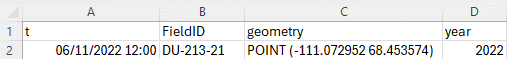

# AI sea ice forecasts for Arctic conservation: A case study predicting the timing of caribou sea ice migrations
This codebase accompanies the Ecological Solutions and Evidence paper [AI sea ice forecasts for Arctic conservation: A case study prediction the timings of caribou sea ice migrations](link). We include core functions and scripts in the `src` directory which can be re-used or adapted for other analysis, as well as a notebook which can be used to produce plots from the paper.

Our analysis also made use of the [IceNet python library](https://github.com/icenet-ai/icenet), which we refer readers to for code relating to forecast generation and assessment. Full documentation is provided, and an interactive guide to sea ice forecasting using IceNet is available on [The Environmental AI book](https://acocac.github.io/environmental-ai-book/polar/modelling/polar-modelling-icenet.html).

**Please note:** The caribou satellite telemetry data used in the study is held by the Government of Nunavut and is not publicly available. We have therefore removed outputs from the codebase which reveal specifics relating to that data. Functions and scripts are still provided, as well as an example of data structure so they could be adapted for other similar datasets. 

While the original telemetry dataset is not provided, result summary files, as well as the IceNet forecasts and model weights used for this study, are available for download from the [Polar Data Centre](https://doi.org/10.5285/8738b3cb-52c7-4b36-aa6d-6e15c0b46ba4). These result files can be used to reproduce the plots from the paper using the notebook [make_paper_plots.ipynb](make_paper_plots.ipynb). For any questions please contact eller@bas.ac.uk.

### Table of contents

<!-- TOC -->
* [Introduction](#introduction)
* [Installation](#installation)
    * [Set up environment](#setup)
    * [Download data](#download)
* [Outline of functions and scripts](#outline)
    1. [Preprocessing and data exploration](#preprocessing)
    2. [Extract migration-start points](#migration-start)
    3. [Get SIC profiles at migration-start points](#sic-profiles)
    4. [Run MADE analysis](#made-analysis)
    5. [Get percent migrate mappings](#percent-migrate)
    6. [Make output plots](#output-plots)
* [Reusing or adapting the code](#reuse)
* [Acknowledgements](#acknowledgements)
* [Funding](#funding)
<!-- TOC -->

## Introduction 
Every autumn, Dolphin and Union caribou wait for sea ice to form before continuing their southward migration from Victoria Island to mainland Canada. During sea ice crossings icebreaking vessels pose a serious risk to caribou, weakening the ice and potentially delaying the migration or forcing caribou into open leads. Having early warning of when the peak migration is likely to take place in a given year could improve mitigation of icebreaking vessels.

In this analysis we explore the potential of using AI sea ice forecasts, from the IceNet model, to predict the sea ice crossing-start times of Dolphin and Union caribou.

https://github.com/user-attachments/assets/d14d0bfa-b2f1-4e26-ae87-3208becc27fc

*Animation of Dolphin and Union caribou migration movements in relation to OSI-SAF sea ice concentration data.*

## Installation 
### Set up environment 
After cloning this repo, set up the conda environment as follows:
* If you do not have conda installed, you can download [here](https://docs.conda.io/projects/conda/en/latest/user-guide/install/index.html). 
* In the root of the repository run `conda env create --file environment.yml`.
This will install the required packages listed in `environment.yml` and create a new conda environment called `icenet-caribou`: 
* Activate the environment before running code: `conda activate icenet-caribou`

### Download data 
In `data` folder, download:
* OSI-SAF data from https://osisaf-hl.met.no/. Should be placed in `data/osisaf`. 
* AMSR2 data from https://data.seaice.uni-bremen.de/. The script `src/data/download_amsr2.py` can be used to automatically download daily files and concatenate into yearly .nc files. These should be placed in `data/amsr2`. 
* OSM land polygon data from https://osmdata.openstreetmap.de/data/land-polygons.html. This should be placed in `data/osm`. 
* Caribou telemetry data is restricted access and not available for download. A reference of data structure is given below and in `data/tracking_data/example_migration_data_format.csv`, for those wishing to adapt analysis scripts for their own datasets. An example of loading this demonstration file is provided in notebook [0.1-test-load-tracking-data](notebooks/0.2-test-load-tracking-data.ipynb). 

  
   
  <em>Structure of .csv telemetry data. "t" is the fix time, "FieldID" is the unique reference for the collared caribou, "geometry" is the lat/lon of the location the fix was recorded at, and "year" is the year the migration starts.</em>

## Outline of functions and scripts 

#### The notebook [make_paper_plots.ipynb](make_paper_plots.ipynb) can be run using summary result files and IceNet forecasts available from the [PDC](https://doi.org/10.5285/8738b3cb-52c7-4b36-aa6d-6e15c0b46ba4), without the need for the full caribou telemetry dataset. 

#### A summary of functions and scripts for the full analysis are provided below. We note that some have been adapted to remove specifics relating to the migration dataset:

#### 1. Preprocessing and data exploration 
* Make Victoria Island Polygon from OSM data. Use notebook [0.2-make-victoria-island-polygon](notebooks/0.2-make-victoria-island-polygon.ipynb). 
* Make coastal grid cell masks (AMSR/OSISAF cells which intersect with VI buffer). Use notebook [0.4-make-coast-grid-mask](notebooks/0.4-make-coast-grid-mask.ipynb)

#### 2. Extract migration-start points 
* Run get_migration_start_points.py in `src/analysis` folder. 

#### 3. Get SIC profiles at migration-start points 
* Run get_sic_at_migration_start.py in `src/analysis` folder

#### 4. Run MADE analysis 
* Run run_made_analysis.py in `src/analysis` folder to conduct hyperparameter search 

#### 5. Get percent migrate mappings 
* Run make_percent_migrate.py in `src/analysis` folder to get percent migrated/ SIC mappings

#### 6. Make output plots 
* Run make_early_warning_map.py in `src/plot` folder. Outputs an example migration prediction map.
* Run make_migration_timelines.py in `src/plot` folder. Compares predicted migration start ranges.
* Run icenet_leadtime_range_plots.py in `src/plot` folder. Plots predicted migration-start ranges for different initialisation dates. 

## Reusing or adapting the code 
If you reuse or adapt this script, please cite the associated manuscript:

Ellen Bowler, James Byrne, Lisa-Marie Leclerc, Amélie Roberto-Charron, Martin S.J. Rogers, Rachel D. Cavanagh, Jason Harasimo, Melanie L. Lancaster, Ryan S.Y. Chan, Oliver Strickson, Jeremy Wilkinson, Rod Downie, J. Scott Hosking, Tom R. Andersson. "AI sea ice forecasts for Arctic conservation: A case study predicting the timing of caribou sea ice migrations". *Ecological Solutions and Evidence*.

## Acknowledgements 
Many thanks to the Hunters and Trappers Organisations for their support and expertise, as well as the field technicians, net gunning crews, pilots and lotek/telonics collar manufacturers who have supported satellite telemetry collar studies over the years. Thanks to Bryn Ubald in the BAS Digital Innovation Team for his time and input using the IceNet library. Thanks also to Brandon Laforest and Emina Ida at WWF-Canada for their valuable inputs throughout the project, as well as Robin Kite at Caslys Consulting Ltd for her help preparing, organising, and providing expertise on the telemetry data. 

## Funding 
This work was supported under the WWF-UK Arctic IceNet grant (project number GB085600), the EPSRC Grant EP/Y028880/1 and the Environment and Sustainability Grand Challenge at the Alan Turing Institute. 
